# UX Design Specification kindergarten-canvas

**Author:** Desi
**Date:** 2026-02-02

---

## Executive Summary

### Project Vision

kindergarten-canvas is a Bulgarian-language admin panel that empowers kindergarten staff to take full control of their website content. The system eliminates dependency on technical staff by providing a user-friendly, confidence-building interface for managing 6 content types (News, Jobs, Deadlines, Events, Gallery, Teachers). The primary goal is enabling administrators to keep their website regularly updated with current information through an interface that feels accessible, not intimidating.

### Target Users

**Primary User: Kindergarten Administrator**
- Age: 40-50 years old
- Tech skill level: Basic (comfortable with everyday software, but no prior experience with content publishing platforms or admin panels)
- Language: Bulgarian only (dd.MM.yyyy date format)
- Context: Works from kindergarten office desktop primarily, but needs responsive access on tablet and mobile
- Motivation: Wants control and independence to update content "whenever there's an update to share"
- Confidence level: Not nervous about technology, but lacks experience with content management systems

### Key Design Challenges

1. **Responsive Admin Panel Complexity**
   - TipTap WYSIWYG editor must work intuitively on touch screens (mobile/tablet)
   - Complex multi-field forms need touch-friendly layouts
   - Date pickers and drag-and-drop file uploads must function seamlessly across all devices
   - Maintaining productivity on smaller screens while preserving full functionality

2. **First-Time Publisher Experience**
   - Users have zero prior content publishing experience
   - Must build confidence through clear, immediate feedback at every action
   - Draft vs Published states must be unmistakably clear
   - Error prevention through smart validation that guides rather than blocks

3. **Multi-Content-Type Cognitive Load**
   - 6 distinct content types with different creation workflows
   - Users need clear mental models to navigate without feeling overwhelmed
   - Quick access to the right content type without hunting through menus

### Design Opportunities

1. **"Impossible to Break" Confidence Builder**
   - Visual preview system that shows exactly what will be published before it goes live
   - Easy undo/revert patterns for all actions
   - Persistent status indicators showing current state at all times
   - Safe exploration environment that encourages learning through use

2. **Quick-Action Workflow Optimization**
   - Fast-path content creation for common tasks (news updates, photo uploads)
   - Dashboard showing at-a-glance what needs attention
   - One-click publishing after preview confirmation
   - Minimize clicks from login to published content

3. **Visual-First Clarity**
   - Leverage preview capabilities to reduce uncertainty
   - Show real-world appearance of content throughout creation process
   - Use visual differentiation (color, icons, layout) to distinguish content types
   - Bulgarian-optimized date and text formatting visible throughout interface

## Core User Experience

### Defining Experience

The core experience of kindergarten-canvas centers on **rapid news publishing with confidence**. The most frequent user action is creating and publishing news announcements - time-sensitive updates that parents and staff need to see immediately. The system is optimized for the workflow: "I need to share news" → create content → preview → publish live in 3 clicks or less.

Every interaction is designed to build confidence for first-time publishers by making the system state transparent and eliminating the fear of "breaking something." Users should always know exactly what is draft, what is published, and what will appear on the public website.

### Platform Strategy

**Responsive Web Application:**
- Single codebase with identical functionality across all devices (desktop, tablet, mobile)
- Desktop remains primary work environment (kindergarten office)
- Tablet and mobile provide full admin capabilities with responsive, touch-optimized layouts
- No offline functionality - always requires internet connection
- File uploads from device gallery (no camera integration in MVP)

**Input Methods:**
- Desktop: Mouse and keyboard optimized
- Mobile/Tablet: Touch-friendly with appropriate tap targets, swipe gestures, and on-screen keyboards
- TipTap WYSIWYG editor adapts to both input methods seamlessly
- Radix UI Date Picker supports both mouse selection and touch interaction

### Effortless Interactions

**Auto-Save Protection:**
- Invisible auto-save runs continuously in background
- Users never lose content, even if browser closes or connection drops
- No "save" anxiety - content is always protected

**Real-Time Preview:**
- Preview updates as user types
- Shows exact appearance on public website (Bulgarian formatting, actual fonts/colors)
- Eliminates uncertainty about how content will look when published

**Smart Defaults:**
- Publish date auto-populates to today's date (dd.MM.yyyy format)
- Content type selection maintained in context (creating news stays in news)
- Form validation guides rather than blocks - suggests corrections before submission

**Separation of Save and Publish:**
- Distinct "Save Draft" and "Publish" actions
- Clear visual distinction between draft and published states
- Confidence-building: users can save work-in-progress without making it public

**Automatic Image Optimization:**
- Images uploaded to Cloudinary are automatically optimized
- Cropping and resizing handled intelligently
- Users don't think about file sizes or formats

### Critical Success Moments

**First Publish Success:**
- The moment when user clicks "Publish" and immediately sees news live on the public website defines "this is better"
- Instant feedback loop: action → result visible immediately
- Builds confidence for repeated use

**Never Losing Work:**
- Auto-save ensures no content is ever lost
- If connection drops, draft is preserved
- Users can safely explore without fear of losing progress

**Error Prevention Before Publishing:**
- Validation catches issues before publish button is active
- Clear, helpful error messages in Bulgarian guide corrections
- Users never experience the horror of publishing broken content

**Clear State Visibility:**
- Draft vs Published status always visible with unmistakable visual indicators
- Users never wonder "is this live?" - they always know
- Content type context always clear (no confusion about what's being edited)

### Experience Principles

These principles guide all UX decisions for kindergarten-canvas:

1. **News-First Optimization** - The entire system is optimized for the "create news → preview → publish live" workflow as the golden path. News announcements are the most frequent action, so this experience must be flawless.

2. **Confidence Through Transparency** - Draft vs Published states must be unmistakably visible at every moment. Error prevention happens before publishing, not after. Users should never wonder "is this live or not?"

3. **Invisible Safety Net** - Auto-save works silently in the background so content is never lost. Real-time preview shows exactly what will appear on the public site, eliminating surprises.

4. **Touch-Friendly Everywhere** - Identical functionality across desktop, tablet, and mobile with responsive layouts that adapt to device size while maintaining full capability on all platforms.

5. **3-Click Publishing** - From "I need to share news" to "published and live on website" in 3 clicks maximum, with smart defaults (like auto-populated publish date) reducing manual entry.

## Desired Emotional Response

### Primary Emotional Goals

The primary emotional goal of kindergarten-canvas is to create a sense of **calm confidence and effortless control**. Users should feel capable and empowered to manage their kindergarten's website content independently, without anxiety or dependence on technical staff. The experience should feel straightforward and worry-free, even for users with basic technical skills and no prior content management experience.

Key emotional outcomes:
- **Empowered**: "I own the content and control the website"
- **Confident**: "I can do this successfully without help"
- **Capable**: "Even without deep tech knowledge, I'm managing this well"
- **Calm**: "No stress or worry about breaking things"
- **Efficient**: "Updates happen quickly without unnecessary effort"
- **Accomplished**: "I've published content and it looks exactly right"

### Emotional Journey Mapping

**First Login (Discovery):**
- Feel welcomed and reassured by clear, Bulgarian interface
- Cautiously optimistic: "Let's see if this really is easy"
- Guided through initial orientation without feeling overwhelmed
- Reassured by visible safety mechanisms (auto-save, preview)

**During Core Action (Creating & Publishing News):**
- Feel smooth and natural throughout the workflow
- Experience growing confidence with each completed step
- Sense of control: always know what state content is in (draft/published)
- Calm focus: no anxiety about making mistakes

**After Task Completion (News Published):**
- Feel accomplished: "I did that myself!"
- Proud: content looks professional and is live on the site
- Relieved and satisfied: task completed without issues
- Confident to return and do it again

**When Errors Occur:**
- Feel guided rather than frustrated: system explains how to fix issues
- Still in control: errors are caught before publishing, not after
- Calm recovery: clear Bulgarian messages show the path forward
- Trust maintained: system prevents problems, doesn't create them

**Returning Users (Second, Third Time):**
- Increasingly confident with each use
- Familiar efficiency: muscle memory develops for common tasks
- Growing mastery: "I know exactly what to do"
- Satisfaction becomes routine: publishing is now effortless

### Micro-Emotions

Critical micro-emotional states for kindergarten-canvas success:

**Confidence vs. Confusion:**
- ALWAYS confidence: every interaction reinforces capability
- System state always clear (draft/published, what's being edited)
- Visual hierarchy guides attention to next action
- No confusion about where things are or what to do

**Trust vs. Skepticism:**
- ALWAYS trust: system protects work through auto-save
- Preview shows exactly what will be published (no surprises)
- Validation prevents errors before they happen
- Undo/revert patterns provide safety nets

**Accomplishment vs. Frustration:**
- ALWAYS accomplishment: 3-click workflows complete tasks quickly
- Instant feedback: see published content immediately
- Smart defaults reduce manual work
- Success moments are clear and celebrated

**Calm vs. Anxiety:**
- ALWAYS calm: no "save" anxiety (auto-save handles it)
- No fear of breaking things (preview before publish)
- No uncertainty about system state (clear indicators)
- No stress from complicated workflows (straightforward paths)

### Design Implications

Each emotional goal translates to specific UX design approaches:

**Calm & Confident Design:**
- Clear visual hierarchy with plenty of white space
- Unmistakable status indicators (draft badges, published badges, color coding)
- Gentle, professional color palette (avoid aggressive reds/warnings)
- No overwhelming options: show only what's needed for current task
- Predictable behavior: buttons do what labels say they'll do
- Consistent patterns across all 6 content types

**Effortless Control Design:**
- 3-click maximum for news publishing workflow
- Smart defaults auto-populate common fields (publish date = today)
- Auto-save protection runs invisibly in background
- Real-time preview eliminates guesswork about final appearance
- Separate "Save Draft" and "Publish" actions prevent accidents
- Direct manipulation: drag-and-drop for images, click-to-edit for text

**Capable Without Tech Knowledge Design:**
- 100% Bulgarian language throughout (no English fallbacks)
- Helpful inline guidance at key decision points
- Validation messages that teach ("Title must be at least 3 characters") rather than block
- Visual previews instead of code/technical settings
- Icons and visual cues supplement text labels
- dd.MM.yyyy date format matches Bulgarian expectations

**Reassured & Supported Design:**
- Clear error messages in Bulgarian that guide solutions ("Add at least one image to continue")
- Auto-save status indicator shows work is protected
- Preview before publish: see exactly what will go live
- Easy undo/revert patterns for all actions
- Confirmation dialogs for destructive actions (delete, unpublish)
- Help text that explains "why" not just "what"

### Emotional Design Principles

These principles guide emotional design decisions for kindergarten-canvas:

1. **Build Confidence Continuously** - Every interaction should reinforce the user's belief that they can successfully manage content. Provide immediate feedback, clear status indicators, and visible progress toward goals.

2. **Eliminate Anxiety Sources** - Remove all sources of user anxiety: auto-save eliminates "losing work" fear, preview eliminates "will it look right?" fear, validation eliminates "did I break it?" fear.

3. **Guide, Don't Block** - When users make errors, guide them toward solutions with helpful Bulgarian messages rather than blocking progress with technical jargon or unhelpful warnings.

4. **Make Success Visible** - Celebrate accomplishments clearly: published content appears immediately on public site, success messages confirm actions, visual indicators show what's been completed.

5. **Straightforward Over Clever** - Prioritize clarity and simplicity over clever interactions or hidden features. Users should never wonder "how do I...?" - the path forward should always be obvious.

## UX Pattern Analysis & Inspiration

### Inspiring Products Analysis

To inform kindergarten-canvas design decisions, we analyzed products that non-technical users already love and use successfully: **Facebook** and **Email applications (Gmail/Outlook)**. These products represent the daily digital experience of our target users and provide proven patterns for simplicity and user-friendliness.

**Facebook - Social Media Posting:**

Facebook excels at making content creation effortless for non-technical users through:
- **Prominent "Post" action** - Always visible, users immediately know where to start creating content
- **Auto-save drafts** - Users can begin writing and return later without losing work
- **Preview before posting** - See exactly what will appear before it goes live to friends/public
- **Clear published status** - Once posted, content is obviously live with immediate visual confirmation
- **Simple 3-action workflow** - Text box → Add photo → Post button (done in one screen)
- **Visual feedback** - Immediate confirmation when something is published ("Post shared")
- **No technical terminology** - Plain language: "Post," "Share," "Photo," never "publish workflow" or "metadata"

**Email Applications (Gmail/Outlook):**

Email applications demonstrate clarity and reliability for basic users through:
- **Clear Draft vs Sent distinction** - Different folders/views make state unmistakable
- **Constant auto-save** - Users never lose a draft, even if browser crashes
- **Compose button always visible** - Primary action is obvious and accessible
- **Simple attachment handling** - Drag-and-drop or click to upload files
- **Clear error messages with guidance** - "Attachment too large (25MB limit). Try compressing the file."
- **Predictable behavior** - Send button sends, Draft button saves, Delete button deletes (no surprises)

### Transferable UX Patterns

Based on Facebook and Email success patterns, kindergarten-canvas will adopt:

**Navigation & Primary Actions:**
- **Prominent "Create News" button on dashboard** - Inspired by Facebook's "Post" and Email's "Compose" - primary action always visible
- **Content type cards with clear icons** - Visual navigation to all 6 content types (News, Jobs, Events, etc.) without menu hunting
- **Dashboard shows status at-a-glance** - Like Email's Draft/Sent folders, show what's published vs draft

**Auto-Save & State Management:**
- **Invisible auto-save every 10 seconds** - Like both Facebook and Email, protect work continuously in background
- **Clear Draft/Published visual distinction** - Badge colors, separate sections, unmistakable status (inspired by Email folders)
- **Auto-save status indicator** - Small, non-intrusive "Saved" indicator (like Google Docs) for reassurance

**Content Creation Workflow:**
- **Single-screen creation forms** - Like Facebook posts, keep all fields visible on one page (no multi-step wizards)
- **Preview before publish** - Show exact public site appearance before going live (Facebook preview pattern)
- **3-click maximum publishing** - Click "Create News" → Fill form → Click "Publish" (inspired by Facebook's simplicity)

**Feedback & Confirmation:**
- **Immediate visual confirmation** - "Your news is now live!" success message with link to view (like Facebook post confirmation)
- **Error messages with guidance** - "Title must be at least 3 characters" instead of "Validation error: field required" (Email pattern)

**Touch & Mobile Patterns:**
- **Drag-and-drop image upload** - Like Email attachments, simple file handling
- **Touch-friendly tap targets** - Large buttons and spacing for mobile/tablet use
- **Swipe gestures where natural** - Swipe to delete draft (common mobile pattern)

### Anti-Patterns to Avoid

Learning from failures in admin panel UX, kindergarten-canvas will avoid:

**Hidden Navigation:**
- ❌ Hamburger menus hiding primary actions - Users shouldn't hunt for "Create News"
- ✅ Always show primary actions prominently like Facebook's "Post" button

**Technical Terminology:**
- ❌ "CMS," "metadata," "taxonomy," "slug," "permalink," "WYSIWYG"
- ✅ Plain Bulgarian language: "Create," "Publish," "Draft," "Edit," "Delete"

**Complex Multi-Step Wizards:**
- ❌ 7-step wizards with "Next/Previous" navigation for simple content creation
- ✅ Single-screen forms like Facebook posts (all fields visible at once)

**Unclear Save States:**
- ❌ No indication of save status, leaving users wondering "did it save?"
- ✅ Always show save status like Email/Google Docs ("Saved," "Saving...")

**Overwhelming Options:**
- ❌ Showing every possible setting and option on content creation screen
- ✅ Show only essential fields, hide advanced options (Facebook's approach)

**Destructive Actions Without Confirmation:**
- ❌ Delete button immediately deletes without asking
- ✅ Confirm destructive actions: "Are you sure you want to delete this news?"

**Mobile-Unfriendly Touch Targets:**
- ❌ Small buttons too close together for touch screens
- ✅ Minimum 44x44px touch targets with adequate spacing

### Design Inspiration Strategy

**What to Adopt Directly:**

1. **Prominent primary action pattern** (Facebook "Post" button) - Create News button always visible on dashboard, supports news-first optimization goal

2. **Auto-save with status indicator** (Email/Google Docs) - Eliminates "losing work" anxiety, supports calm confidence emotional goal

3. **Preview before publish** (Facebook post preview) - Shows exact public appearance, eliminates uncertainty, supports confidence through transparency principle

4. **Clear state distinction** (Email Draft/Sent folders) - Unmistakable visual difference between draft and published content, supports confidence through transparency

5. **Simple error messages** (Email attachment guidance) - Bulgarian messages that guide solutions, supports capable without tech knowledge goal

**What to Adapt for Kindergarten Context:**

1. **Single-screen forms** (Facebook posts) - Adapt for 6 different content types with varying complexity (News is simple like Facebook, Events need date/time fields, Jobs need application handling)

2. **Visual confirmation** (Facebook "Post shared") - Adapt to show "News published!" plus link to view on public kindergarten website (more context-specific)

3. **Drag-and-drop uploads** (Email attachments) - Adapt for Cloudinary image optimization with automatic resizing/cropping for kindergarten gallery needs

**What to Avoid Completely:**

1. **Hidden hamburger navigation** - Conflicts with straightforward over clever principle and news-first optimization

2. **Technical jargon anywhere in UI** - Conflicts with capable without tech knowledge goal and Bulgarian-only requirement

3. **Multi-step wizards for simple content** - Conflicts with 3-click publishing principle and effortless control goal

4. **Unclear save states** - Conflicts with eliminate anxiety sources principle and invisible safety net goal

This strategy ensures kindergarten-canvas learns from proven patterns while maintaining focus on simplicity, user-friendliness, and the specific needs of Bulgarian kindergarten administrators with basic technical skills.

## Design System Foundation

### Design System Choice

kindergarten-canvas uses **shadcn-ui + Tailwind CSS + Radix UI** as the design system foundation - a themeable component system that provides full brand control over a proven, accessible base. This was established in the architecture decisions and aligns perfectly with the project's UX goals.

- **Tailwind CSS** - Utility-first styling with built-in responsive breakpoints and dark mode support
- **shadcn-ui** - Themeable, copy-paste component library (owned code, not a locked dependency)
- **Radix UI** - Accessible primitives powering shadcn-ui (WCAG 2.1 Level AA compliance built in)

**Theme:** Light and Dark mode supported
**Corner Radius:** Rounded (friendly/soft) across all components - reinforces the calm, approachable emotional goals

### Rationale for Selection

1. **Accessibility out of the box** - Radix UI primitives handle keyboard navigation, ARIA labels, focus states automatically - critical for WCAG 2.1 Level AA compliance without manual effort

2. **Full visual customization** - shadcn-ui components are styled via Tailwind and CSS custom properties (design tokens), giving complete control over colors, spacing, and border radius to match our calm/confident brand

3. **Responsive by default** - Tailwind's responsive utility classes make the identical-functionality-across-devices requirement straightforward to implement

4. **Dark mode built in** - Tailwind's dark mode system (`dark:` variant) pairs with shadcn-ui's theming to support both light and dark themes with minimal effort

5. **Consistent patterns** - Pre-built components (buttons, inputs, badges, cards, dialogs) ensure all 6 content types use identical interaction patterns - no confusion between content types

6. **Maintainability** - shadcn-ui components are copied into the project (not a black-box dependency), making long-term maintenance and customization straightforward

### Color Palette & Design Tokens

A calm, confidence-building palette derived from our emotional design goals:

**Primary Colors (Trust & Confidence):**
- Primary: `#3B82F6` (soft blue) - main actions, buttons, links
- Primary Hover: `#2563EB` - button hover states
- Primary Foreground: `#FFFFFF` - text on primary buttons

**Secondary Colors (Warmth & Friendliness):**
- Secondary: `#E2E8F0` (light gray) - secondary buttons, backgrounds
- Secondary Foreground: `#1E293B` - text on secondary elements

**Status Colors (Clear State Visibility):**
- Published/Success: `#22C55E` (green) - published badges, success messages
- Published Foreground: `#FFFFFF`
- Draft/Warning: `#F59E0B` (amber) - draft badges, pending states
- Draft Foreground: `#FFFFFF`
- Error/Destructive: `#EF4444` (soft red) - error messages, delete actions
- Error Foreground: `#FFFFFF`
- Info: `#8B5CF6` (soft purple) - informational badges, tooltips

**Neutral Scale (Backgrounds & Text):**
- Background: `#FFFFFF` (light) / `#0F172A` (dark)
- Surface: `#F8FAFC` (light cards) / `#1E293B` (dark cards)
- Border: `#E2E8F0` (light) / `#334155` (dark)
- Text Primary: `#1E293B` (light) / `#F1F5F9` (dark)
- Text Secondary: `#64748B` (light) / `#94A3B8` (dark)
- Muted: `#F1F5F9` (light) / `#1E293B` (dark)

**Border Radius Tokens (Friendly/Soft):**
- Radius Small: `6px` - badges, tags, small elements
- Radius Default: `8px` - buttons, inputs, most components
- Radius Medium: `12px` - cards, form containers
- Radius Large: `16px` - modals, panels, dashboard cards

### Implementation Approach

**Token System:**
- All design tokens defined as CSS custom properties in a global stylesheet
- shadcn-ui's built-in theming hooks directly into these tokens
- Light/dark mode switches tokens via Tailwind's `dark:` class on root element
- Single source of truth: change a token value and it updates everywhere

**Component Layers:**
1. **Base layer** - Radix UI primitives (accessibility, behavior)
2. **Style layer** - shadcn-ui components styled via Tailwind (consistent look)
3. **Custom layer** - Project-specific overrides using design tokens (brand identity)

**Dark Mode Implementation:**
- Root `dark` class toggled by user preference or system setting
- All background, text, and border colors defined for both themes via tokens
- Status colors (Draft amber, Published green) remain consistent across themes for clarity

### Customization Strategy

**Status Badge System (Critical for Confidence Through Transparency):**
- Draft badge: Amber background (`#F59E0B`) + white text + rounded pill shape
- Published badge: Green background (`#22C55E`) + white text + rounded pill shape
- Always visible next to content titles on dashboard and edit screens
- Never ambiguous: color + text label together

**Auto-Save Indicator:**
- Small, subtle text indicator near form title: "Saved" (green checkmark) / "Saving..." (spinner)
- Uses Text Secondary color - present but never attention-grabbing
- Disappears after 3 seconds once saved, reappears on next change

**Form Components:**
- All inputs use Radius Default (8px) - friendly and approachable
- Focus states use Primary color border (`#3B82F6`) with subtle glow
- Validation messages appear inline below fields in helpful Bulgarian text
- TipTap editor styled consistently with other form inputs (same borders, radius, focus)

**Button Hierarchy:**
- Primary button (Publish): Primary blue, full weight - the main action
- Secondary button (Save Draft): Secondary gray - important but not dominant
- Ghost button (Cancel/Back): No background, text only - least emphasis
- Destructive button (Delete): Red, only appears in confirmation dialogs

**Content Type Cards (Dashboard):**
- All cards use Radius Medium (12px) for friendly appearance
- Each content type has a distinct icon + label
- Cards show count of drafts vs published items at a glance
- Hover state uses subtle shadow elevation (no color change) - calm interaction

## 2. Core User Experience

### 2.1 Defining Experience

The defining experience of kindergarten-canvas is: **"Publish news to the kindergarten website in 3 clicks - and every parent sees it instantly."**

This is the interaction that transforms the administrator's daily workflow. Currently, sharing updates means calling parents one by one - slow, repetitive, and exhausting. kindergarten-canvas replaces that with a single action: write, preview, publish. The moment a user publishes their first news item and realizes "everyone will see this now, and I didn't have to call anyone" - that's the moment that defines the product's value.

### 2.2 User Mental Model

**Current Reality:**
- Users share updates via phone calls - individual, time-consuming, inefficient
- This process feels draining: too much time and effort for something that should be simple
- No existing digital content management experience to draw from

**Mental Model They Bring:**
- Facebook-like posting is the closest familiar reference: "I write something, add a photo, and it goes out"
- The expectation is: text box → add image → done. Simple, one-screen, no fuss
- Users will expect the kindergarten-canvas flow to feel at least as simple as posting on Facebook
- Any step that feels more complex than Facebook posting will create friction

**Key Expectation:**
- The entire flow should feel like a natural evolution of "sharing news" - just in a more powerful, permanent way than a phone call
- Users shouldn't have to think about "publishing" as a technical action - it should feel like "sharing" something they already know how to do

### 2.3 Success Criteria

The core experience succeeds when:

1. **Speed** - The entire flow from "I need to share news" to "it's live" takes under 2 minutes. Faster than composing a WhatsApp message to a group
2. **Simplicity** - No step in the flow requires thought or hesitation. Each action is obvious: what to do next is always clear
3. **Confidence at the Publish Step** - The publish button is the moment of truth. Users must feel 100% sure about what they're doing when they click it:
   - Preview shows exactly what will appear on the public site
   - Status changes visibly from Draft to Published
   - Immediate success confirmation in Bulgarian
4. **Instant Visibility** - After publishing, the news is immediately visible on the public kindergarten website. The feedback loop is instant: action → result
5. **No Fear** - Users never hesitate because they're afraid of making a mistake. Auto-save protects work, preview eliminates surprises, and the system guides corrections

### 2.4 Novel UX Patterns

kindergarten-canvas uses **established patterns** - no novel interaction design needed. This is the right call for basic-skill users who need calm confidence, not learning curves.

**Established Patterns Adopted:**
- **Facebook-style posting** - Write text, add image, publish. Single-screen, familiar flow
- **Email-style draft/sent states** - Clear distinction between draft and published content
- **Google Docs-style auto-save** - Invisible, continuous protection in background
- **Standard form validation** - Inline error messages that guide corrections

**Our Unique Twist Within Familiar Patterns:**
- **The "phone call replacement" moment** - The success confirmation after publishing explicitly reinforces that this replaces the old way: "News is live! Parents can see it now on the website." This makes the value proposition visceral in the moment
- **Context-specific preview** - Preview shows the actual kindergarten website layout, not a generic preview. Users see their news exactly where parents will find it
- **Publish date auto-populated to today** - Since most news is time-sensitive, the system assumes "now" unless changed. Reduces friction on the most common action

### 2.5 Experience Mechanics

**Step-by-step flow for the defining experience: "Publish News"**

**1. Initiation:**
- User lands on dashboard and sees "Create News" button prominently (primary action, blue, top of content cards)
- Single click opens the news creation form
- No menus to navigate, no content type selection screen - "Create News" goes directly to the news form

**2. Interaction:**
- Single-screen form with fields visible all at once (no multi-step wizard):
  - **Title** - Text input at the top, large and prominent (Bulgarian placeholder text)
  - **Body** - TipTap WYSIWYG editor below title. Feels like typing in a document - bold, italic, lists work as expected
  - **Image(s)** - Drag-and-drop zone or click-to-upload below editor. Shows thumbnail preview immediately after upload. Cloudinary handles optimization automatically
  - **Publish Date** - Auto-populated to today (dd.MM.yyyy). User can change if needed
- Auto-save runs invisibly. Small "Saved" indicator appears briefly after each save
- "Preview" button available to see exactly how news will look on the public site

**3. Feedback:**
- **While typing:** Real-time auto-save indicator ("Saved") gives quiet reassurance
- **Image upload:** Thumbnail appears immediately, progress indicator during upload, success when done
- **Validation:** If title is empty or too short when user tries to publish, inline message guides: "Заведете поне 3 символа за заглавката" (Enter at least 3 characters for the title)
- **Preview:** Full-page preview of exactly how the news will appear on the kindergarten website
- **Draft status:** Amber "Draft" badge visible at all times until published

**4. Completion:**
- User clicks **"Publish"** button (primary blue, prominent)
- Status badge instantly changes from amber "Draft" to green "Published"
- Success toast notification: "Новини публикувани успешно!" (News published successfully!) with a link to view on the public site
- User can click the link to verify it's live - immediate confirmation
- Dashboard updates to show the news item as "Published"
- The entire flow from clicking "Create News" to seeing "Published" badge: 3 clicks (Create News → form filled → Publish)

## Visual Design Foundation

### Color System

The color system was established in the Design System Foundation section and is referenced here for completeness. Colors are defined as CSS custom properties (design tokens) and shared across the entire application via shadcn-ui theming.

**Key color roles for visual foundation:**
- **Primary blue (`#3B82F6`)** - All primary actions, active navigation states, focus rings
- **Published green (`#22C55E`)** - Success states, published badges, positive confirmations
- **Draft amber (`#F59E0B`)** - Draft badges, pending states, items needing attention
- **Error red (`#EF4444`)** - Error messages, destructive action indicators
- **Neutral scale** - Backgrounds, text, borders (full light/dark definitions in Design System section)

**Contrast & Accessibility:**
- All text/background combinations meet WCAG 2.1 AA minimum contrast ratios (4.5:1 for normal text, 3:1 for large text)
- Primary text (`#1E293B`) on white background: contrast ratio 15.3:1
- Secondary text (`#64748B`) on white background: contrast ratio 4.6:1
- Status badge text (white on green/amber/red): all exceed 3:1 for large badge text

### Typography System

**Font Choice: Inter**

Inter is the primary typeface for kindergarten-canvas across all text. Rationale:
- Excellent Bulgarian Cyrillic character support - renders beautifully in both Cyrillic and Latin scripts
- Clean, modern, and warm - matches the "calm, confident, friendly" emotional tone
- Highly readable at all sizes - critical for both scannable dashboard text and longer TipTap editor content
- Designed specifically for screens - optimized for digital readability
- Open source, no licensing concerns

**Type Scale:**

| Level | Size | Weight | Line Height | Usage |
|-------|------|--------|-------------|-------|
| H1 | 32px | 700 (Bold) | 1.2 | Page titles (Dashboard, Create News) |
| H2 | 24px | 600 (SemiBold) | 1.3 | Section headings, modal titles |
| H3 | 20px | 600 (SemiBold) | 1.4 | Card titles, form section headers |
| H4 | 18px | 500 (Medium) | 1.4 | Sub-headers, sidebar section labels |
| Body Large | 16px | 400 (Regular) | 1.6 | Main body text, form labels, TipTap editor content |
| Body | 15px | 400 (Regular) | 1.5 | Secondary body text, descriptions |
| Small | 14px | 400 (Regular) | 1.5 | Dates, secondary labels, helper text |
| Badge | 13px | 500 (Medium) | 1 | Status badges (Draft/Published), tags |
| Caption | 12px | 400 (Regular) | 1.4 | Auto-save indicator, fine print |

**Typography Principles:**
- Minimum body text size is 14px - never smaller for readable content (accessibility)
- TipTap editor uses Body Large (16px) for comfortable long-form reading
- Dashboard headings and labels use H3-H4 range - scannable at a glance
- Font weight creates visual hierarchy: Bold for titles, Medium for labels, Regular for body
- Letter spacing kept at default (0) - Inter is designed to read naturally without adjustment

### Spacing & Layout Foundation

**Spacing Unit: 8px base**

All spacing in kindergarten-canvas follows an 8px grid system. This creates visual rhythm and consistency across the entire interface:

| Token | Value | Usage |
|-------|-------|-------|
| Space-1 | 4px | Tight gaps (icon to label) |
| Space-2 | 8px | Inline spacing (badge gaps, small margins) |
| Space-3 | 12px | Form field internal padding |
| Space-4 | 16px | Form field spacing, list item gaps |
| Space-5 | 20px | Between form fields |
| Space-6 | 24px | Card internal padding, section gaps |
| Space-8 | 32px | Between major sections |
| Space-10 | 40px | Page section separators |
| Space-12 | 48px | Between top-level page sections |

**Layout: Airy and Spacious**

The layout prioritizes white space and breathing room - reinforcing the calm, non-overwhelming emotional design:
- Generous padding inside cards (24px) - content doesn't feel cramped
- Clear separation between sections (32-48px) - each area has its own space
- Form fields have 20px vertical spacing - not stacked tightly
- Dashboard cards have 16px gap between them - visible breathing room

**Dashboard Layout: Sidebar + Main Content**

```
┌─────────────┬──────────────────────────────────────┐
│             │                                      │
│  SIDEBAR    │         MAIN CONTENT AREA            │
│  (240px)    │         (fluid, max-width)           │
│             │                                      │
│  Logo       │  ┌──────────┐  ┌──────────┐         │
│             │  │  News    │  │  Jobs    │         │
│  ─────────  │  │  card    │  │  card    │         │
│             │  └──────────┘  └──────────┘         │
│  📰 News    │                                      │
│  💼 Jobs    │  ┌──────────┐  ┌──────────┐         │
│  📅 Events  │  │ Deadlines│  │  Events  │         │
│  ⏰ Deadlines│  │  card    │  │  card    │         │
│  🖼 Gallery │  └──────────┘  └──────────┘         │
│  👨‍🏫 Teachers│                                      │
│             │  ┌──────────┐  ┌──────────┐         │
│  ─────────  │  │ Gallery  │  │Teachers  │         │
│  ⚙ Settings │  │  card    │  │  card    │         │
│             │  └──────────┘  └──────────┘         │
└─────────────┴──────────────────────────────────────┘
```

- **Sidebar width:** 240px (desktop) - spacious enough to read labels clearly
- **Sidebar collapsed:** On tablet/mobile, sidebar collapses to icon-only (48px) or a slide-out drawer. The "Create News" primary action remains visible in the main content area at all times - never hidden
- **Main content:** Fluid width with max-width constraint (960px) - content doesn't stretch too wide on large screens
- **Content grid:** 2-column card grid on desktop (6 content type cards), single column on mobile
- **Sidebar navigation items:** Each item has icon + label, with clear active state (highlighted with Primary blue background), 12px vertical spacing between items

**Responsive Breakpoints:**
- Desktop: ≥1024px - full sidebar + 2-column content grid
- Tablet: 768px–1023px - collapsed icon sidebar + 2-column content grid
- Mobile: <768px - slide-out sidebar drawer + single-column content layout

### Accessibility Considerations

**WCAG 2.1 Level AA Compliance:**

1. **Color contrast** - All text meets minimum contrast ratios (see Color System above). Status badges use color + text label together (never color alone to convey meaning)

2. **Focus indicators** - All interactive elements have visible focus rings using Primary blue (`#3B82F6`) with subtle glow. Critical for keyboard navigation users

3. **Font sizes** - Minimum readable text is 14px. Body content uses 16px. Users can scale text via browser without layout breaking

4. **Touch targets** - All interactive elements on mobile/tablet meet minimum 44x44px touch target size

5. **Keyboard navigation** - Radix UI primitives handle all keyboard interaction patterns (Tab order, Enter/Space activation, Escape to close). No custom keyboard handling needed

6. **Screen reader support** - All form inputs have associated labels. Status badges include text labels. Images have alt text. Semantic HTML throughout (headings hierarchy, lists, landmarks)

7. **Dark mode contrast** - Dark theme token values maintain same contrast ratios as light theme. Status colors (green/amber/red) remain consistent across themes

8. **Reduced motion** - Transitions and animations respect `prefers-reduced-motion` media query. Auto-save indicator and status badge transitions can be disabled

## Design Direction Decision

### Design Directions Explored

Six design directions were explored across different layout philosophies, visual weights, and interaction patterns:

1. **Direction 1 – Clean Cards** — Light sidebar, white content cards on a soft gray background, prominent per-type "Create" buttons. Airy, spacious, and scannable.
2. **Direction 2 – Info-Rich Dashboard** — Dark sidebar with stats overview, recent activity feed, and a quick-create panel. Dense, data-forward.
3. **Direction 3 – Form Focus** — Icon-only sidebar with a full news creation form as the hero screen. Workflow-first approach.
4. **Direction 4 – List View** — Filterable content list/table with all items across types. Power-user oriented.
5. **Direction 5 – Dark Mode First** — Direction 1 layout rendered entirely in dark theme. Same structure, different atmosphere.
6. **Direction 6 – Compact** — Quick-action row at the top with collapsible content sections below. Minimal footprint.

### Chosen Direction

**Direction 1 – Clean Cards** was selected as the design foundation. Each of the 6 content types (News, Jobs, Deadlines, Events, Gallery, Teachers) is represented as a distinct card in a 2-column grid inside the main content area. The sidebar provides persistent navigation. Each card displays a "Create" button for fast content creation and shows at-a-glance counts of draft vs. published items.

**Full CRUD actions per card:** In addition to creating new items, each content card must surface access to existing items with full management capability — including a visible **Delete/Remove** action for each item (teacher profile, job posting, news item, etc.). Destructive actions like delete will be guarded by a confirmation dialog ("Are you sure you want to delete this [item]?") using the Error red (`#EF4444`) destructive button, consistent with the anti-pattern avoidance established in the UX Pattern Analysis section.

### Design Rationale

1. **Matches the established layout foundation** — The sidebar + main content structure from the Visual Design Foundation maps directly onto Direction 1. No tension between the layout spec and the chosen direction.
2. **Supports News-First Optimization** — The "Create News" button is prominent and immediately accessible from the dashboard — the most frequent action is always one click away.
3. **Reinforces Confidence Through Transparency** — Cards display draft/published counts at a glance. Users always know the current state of their content without navigating into each type.
4. **Airy and spacious feel** — White cards on a soft background, generous internal padding, and clear separation between cards match the emotional design goal of calm, non-overwhelming control.
5. **Delete/Remove actions are visible and accessible** — Every content item is manageable from the card view. Users can remove teachers, delete job postings, or archive news items without hunting through hidden menus. This is essential for a complete content management experience and prevents frustration from having creation without deletion.
6. **Scales cleanly across 6 content types** — The card pattern is repeatable and consistent. All content types use the same visual language, reducing cognitive load.

### Implementation Approach

- **Dashboard** renders 6 content type cards in a 2-column grid (responsive: single column on mobile).
- Each card shows: content type icon, title, draft count badge, published count badge, a "Create [Type]" primary button, and a link/button to manage existing items (list view per type).
- **Item list views** (per content type) display items in a scannable list with: title, status badge (Draft/Published), creation date, and action buttons — **Edit** (secondary) and **Delete** (destructive, red, with confirmation dialog).
- The Delete confirmation dialog uses a modal with: item title for context, a warning message in Bulgarian, a Cancel button (secondary), and a "Delete" button (destructive red). Destructive action only executes after confirmation.
- All CRUD operations (Create, Read, Update, Delete) are accessible from within each content type's view. The dashboard cards serve as the entry point; the list/detail views provide full management.

## User Journey Flows

### Journey 1: Create & Publish News (Golden Path)

The defining experience — optimized for 3 clicks from dashboard to live. This is the most frequent user action and the flow that, if perfected, makes the product.

```mermaid
flowchart TD
    A[Dashboard] --> B[Click 'Create News' on News card]
    B --> C[News creation form opens - single screen]
    C --> D[Enter title]
    D --> E[Write body in TipTap editor]
    E --> F{Add image?}
    F -->|Yes| G[Drag-and-drop or click upload]
    G --> H[Image uploads - thumbnail shown immediately]
    H --> I[Review form - auto-save running silently]
    F -->|No| I
    I --> J[Click Preview]
    J --> K[Full-page preview of public site appearance]
    K --> L{Content looks good?}
    L -->|No| N[Return to form - make changes]
    N --> I
    L -->|Yes| M[Click Publish]
    M --> O[Status badge: Draft to Published]
    O --> P[Toast: 'Новини публикувани успешно!' + link to public site]
    P --> Q[Dashboard News card count updates]
```



### Journey 2: Edit & Re-publish Content (Error Recovery)

Based on PRD Journey 2. Find the issue fast, fix it, re-publish with confidence. Designed to take under 1 minute from "I made a mistake" to "it's fixed."


### Journey 3: Delete Content Item

Every item must be deletable — visible action, guarded by confirmation. No hunting through hidden menus. Directly addresses the requirement that all content types support full CRUD.


### Journey 4: Dashboard Navigation & Content Overview

The connective tissue. How users orient themselves and move between content types after login.


### Journey Patterns

**Navigation Patterns:**
- **Dashboard-first orientation** — All journeys start from the dashboard. The 6 content type cards are the primary navigation hub. Sidebar reinforces but doesn't replace card access.
- **Consistent entry point** — Whether accessed from a dashboard card or sidebar, a content type always opens to the same item list view. No ambiguity about where you are.
- **Breadcrumb context** — Inside creation and edit forms, the content type context is always visible (e.g., "News > Create", "Teachers > Edit"). Users never lose their place.

**Decision Patterns:**
- **Preview-before-commit** — Both create and edit journeys offer a preview step before publish/update. Optional but always available — builds confidence before commitment.
- **Confirm-before-destroy** — All delete actions go through a confirmation dialog showing the item title. Cancel is the default safe option. Destructive action requires an explicit second click.

**Feedback Patterns:**
- **Immediate status feedback** — Every terminal action (publish, update, delete) produces a Bulgarian toast notification. Status badges update in real-time on both the item and the dashboard card.
- **Auto-save reassurance** — During creation and editing, the quiet "Saved" indicator confirms work is protected at all times. Users can navigate away without fear.
- **Count synchronization** — After any CRUD action, the dashboard card's draft/published counts update immediately. The effect of every action is reflected in the overview.

### Flow Optimization Principles

1. **Minimize steps to value** — The golden path is 3 clicks. Every other journey follows the same "fewest necessary steps" principle. No redundant screens for non-destructive actions.
2. **Reduce cognitive load at decisions** — Each screen has one clear primary action. Button hierarchy (weight, color, position) makes the next step obvious without hunting.
3. **Progressive disclosure** — Dashboard shows counts at a glance. Lists add action buttons. Forms show all fields at once (no wizards) but group related fields visually.
4. **Error recovery is fast** — Item lists make finding problematic content immediate. Edit forms pre-populate everything. Re-publishing is a single click after preview.
5. **Destructive actions are safe but accessible** — Delete is visible on every item (not hidden), but always requires a confirmation step. One click to initiate, one click to execute.

## Component Strategy

### Design System Components

These components are available from shadcn-ui and require only design token customization (border radius, colors) to match our visual foundation:

- **Button** — Three variants: Primary (Publish/Create — blue), Secondary (Save Draft/Cancel — gray), Destructive (Delete — red). All use Radius Default (8px) and token colors.
- **Input / Textarea** — All text fields across creation and edit forms. Focus ring in Primary blue, inline validation messages below.
- **Card** — Base container for dashboard content type cards. Radius Medium (12px), Surface background.
- **Badge** — Status indicators. Styled as colored pills using status color tokens.
- **Dialog** — Powers Delete Confirmation Dialog and Preview Modal. Radix UI handles focus trapping, Escape-to-close, and accessibility.
- **Toast (Sonner)** — All success/error/info notifications after CRUD actions. Bottom-right, auto-dismissing.
- **Form + Label** — Wraps all creation/edit forms. Validation state binding and accessible label association.
- **Select** — Content type filters in list views.
- **Checkbox** — "Mark as important/urgent" on deadlines and announcements (FR18).
- **Separator** — Visual divider between sidebar sections and form field groups.
- **Sheet** — Powers the mobile sidebar drawer (slide-out navigation).
- **Tooltip** — Hover context on icon-only sidebar items (tablet view).
- **ScrollArea** — Overflow handling in item list views when content exceeds viewport.

### Custom Components

Components beyond what shadcn-ui provides, each designed around specific needs from our user journeys and design direction.

**ContentTypeCard**
- **Purpose:** Dashboard hub card — entry point for each content type. 6 total on dashboard.
- **Content:** Content type icon, title (Bulgarian), draft count, published count, "Create [Type]" button, "Manage" link.
- **Actions:** "Create [Type]" → opens creation form. Card title / "Manage" → opens item list view.
- **States:** Default, Hover (subtle shadow elevation), Active/Focused (Primary blue border).
- **Accessibility:** Card is a landmark. "Create" button has clear aria-label. Counts use aria-label ("3 drafts, 2 published").

**ItemListRow**
- **Purpose:** Displays a single content item in the per-type list view. Scannable and action-ready.
- **Content:** Item title, StatusBadge (Draft/Published), creation date (dd.MM.yyyy), Edit button, Delete button.
- **Actions:** Edit → opens pre-populated edit form. Delete → opens confirmation dialog.
- **States:** Default, Hover (subtle background highlight), Focused (keyboard navigation).
- **Accessibility:** Row is focusable. Edit and Delete buttons include item title in aria-label ("Delete: Учителка Мария").

**StatusBadge**
- **Purpose:** Unmistakable visual indicator of content state. Color + text together — never color alone.
- **Content:** Text label ("Скетч" / "Публикуван" in Bulgarian) inside a colored pill.
- **States:** Draft (Amber `#F59E0B`, white text), Published (Green `#22C55E`, white text).
- **Accessibility:** role="status" for screen readers. Text label always present.

**AutoSaveIndicator**
- **Purpose:** Quiet reassurance that work is being protected. Eliminates "did it save?" anxiety.
- **States:** Saving (spinner + "Запазва…"), Saved (checkmark + "Запазван" — fades after 3 seconds), Error (red + "Неуспешно запазване" — persists).
- **Accessibility:** aria-live="polite" — screen readers announce state changes without interrupting.

**ContentFormShell**
- **Purpose:** Single-screen layout wrapper for all creation and edit forms. Ensures consistency across all 6 content types.
- **Content:** Page header with breadcrumb (content type + action), AutoSaveIndicator, form fields area, sticky action bar (Preview, Save Draft, Publish/Update).
- **Variants:** Create mode and Edit mode. Layout identical — action bar labels and behavior differ ("Publish" for new drafts, "Update" for published items).
- **Accessibility:** Semantic form element. Action bar sticky on scroll. Focus management returns to form after modal interactions.

**PreviewModal**
- **Purpose:** Shows exactly how content will appear on the public kindergarten website before committing. Eliminates publish anxiety.
- **Content:** Full rendering of the item in public site context — title, formatted body, images, date. Read-only.
- **States:** Loading, Viewing.
- **Variants:** Full-screen on mobile, large centered modal on desktop.
- **Accessibility:** Built on shadcn Dialog (Radix). Focus trapped. Escape closes. Screen reader announces "Preview of [item title]".

**DeleteConfirmDialog**
- **Purpose:** Safety gate before any destructive action. Confirms intent with clear context.
- **Content:** Item title, warning message in Bulgarian, Cancel button (secondary), Delete button (destructive red).
- **Actions:** Cancel → closes, no action. Confirm Delete → item removed, toast shown, list updates.
- **Accessibility:** Focus defaults to Cancel (safe option). Destructive button requires deliberate action. aria-describedby on warning text.

**ResponsiveSidebar**
- **Purpose:** Persistent navigation that adapts to device size without losing functionality.
- **Content:** Logo, 6 content type nav items (icons + labels), Settings link.
- **States:** Desktop (full 240px, labels visible), Tablet (48px icon-only, tooltip on hover), Mobile (hidden, slide-out drawer via hamburger).
- **Accessibility:** Nav landmark with aria-label. Active item has aria-current="page". Keyboard navigable. Mobile drawer uses focus trap.

**ImageUploadZone**
- **Purpose:** Handles image upload for News, Gallery, and Teacher profiles. Drag-and-drop friendly with immediate feedback.
- **Content:** Drop zone (dashed border, upload icon, Bulgarian instructions), uploaded thumbnails, progress indicator per image, remove (×) per thumbnail.
- **States:** Idle, Dragging-over (highlighted border), Uploading (progress bar), Uploaded (thumbnails), Error (invalid file — inline message in Bulgarian).
- **Variants:** News (optional single image), Gallery (multiple images), Teachers (single profile photo).
- **Accessibility:** Drop zone has role="button" and keyboard activation. Validation messages in Bulgarian. Each thumbnail has alt text and a labeled remove button.

### Component Implementation Strategy

All custom components are built on the shadcn-ui / Radix / Tailwind foundation:
- **Design tokens** (CSS custom properties) drive all colors, spacing, and radii — custom components inherit the same visual language as shadcn components.
- **Radix primitives** power interactive behavior in Dialog-based components (PreviewModal, DeleteConfirmDialog) — accessibility is handled, not hand-rolled.
- **Tailwind utility classes** handle layout and responsive behavior — no custom CSS needed for spacing, grid, or breakpoints.
- **Component props are content-agnostic** — ItemListRow, ContentTypeCard, DeleteConfirmDialog all accept content type and item data as props. Build once, reuse for all 6 content types.

### Implementation Roadmap

**Phase 1 — Core (required for the golden path and full CRUD):**
- ContentTypeCard — dashboard is the entry point to everything
- ContentFormShell — all creation and editing flows live inside this
- StatusBadge — visible on every item and card
- ItemListRow — needed to view, edit, and delete existing items
- DeleteConfirmDialog — required for safe deletion across all types

**Phase 2 — Supporting (complete the experience):**
- AutoSaveIndicator — reassurance during creation/editing
- PreviewModal — confidence before publishing
- ImageUploadZone — needed for News, Gallery, Teachers content types

**Phase 3 — Polish (responsive and edge cases):**
- ResponsiveSidebar — full responsive behavior across desktop/tablet/mobile

## UX Consistency Patterns

### Button Hierarchy

Every screen has at most one Primary action. Secondary and Ghost actions support but don't compete. Destructive actions only appear inside confirmation dialogs.

| Variant | Color | Usage | Examples |
|---|---|---|---|
| Primary | Blue `#3B82F6` | The single most important action on the screen | Publish, Update, Create News |
| Secondary | Gray `#E2E8F0` | Important but not the main action | Save Draft, Cancel, Back |
| Ghost | Transparent, text only | Least emphasis — tertiary actions | Back to dashboard, View on site |
| Destructive | Red `#EF4444` | Irreversible actions — only inside confirmation dialogs | Delete (after confirmation) |

- **Mobile:** All buttons meet 44px minimum tap target height. Full-width buttons in action bars on mobile for easier touch.
- **Disabled state:** Reduced opacity (60%), cursor not-allowed. Publish button stays disabled until required fields pass validation — prevents publishing broken content entirely.

### Feedback Patterns

**Success (Toast):**
- Trigger: Publish, Update, Delete succeed.
- Position: Bottom-right (desktop), bottom-center (mobile).
- Duration: 4 seconds auto-dismiss.
- Content: Short Bulgarian confirmation + action link where relevant ("Новини публикувани успешно!" + "Виж на сайта" link).
- Visual: Green left border, white background, subtle shadow.

**Error (Toast):**
- Trigger: Network failure, server error on save/publish/delete.
- Duration: 6 seconds (persists longer — errors need attention).
- Content: Plain Bulgarian explanation + guidance ("Неуспешно запазване. Моля, опитайте отново.").
- Visual: Red left border.

**Validation (Inline):**
- Trigger: User attempts to publish with invalid fields, or blurs a field with invalid input.
- Position: Directly below the offending field — never at top of page.
- Content: Helpful Bulgarian guidance ("Заведете поне 3 символа за заглавката"). Teaches, doesn't block.
- Visual: Red text at 14px. Field border turns red.
- Publish button stays disabled until all validation passes — prevention before submission.

**Info (Toast):**
- Trigger: Non-critical informational events.
- Visual: Purple left border (Info `#8B5CF6`).

### Form Patterns

**Layout:**
- Single-screen forms — all fields visible at once. No multi-step wizards.
- Fields grouped logically with visual separation (Separator or 20px gap).
- Labels above fields, never inside. Placeholder text supplements but doesn't replace labels.
- Required fields indicated with a subtle asterisk + "Задължително" label in Bulgarian.

**Auto-Save Behavior:**
- Saves every 10 seconds while user is on a creation/edit form.
- Also triggers on blur (user moves away from a field).
- AutoSaveIndicator shows: "Запазва…" → "Запазван" (fades after 3s).
- Draft is created on first auto-save if one doesn't exist yet.

**Publish vs. Update:**
- New items: action bar shows "Запазвам скетч" (Save Draft) + "Публикувай" (Publish).
- Existing published items: action bar shows "Обнови" (Update). Update publishes immediately.
- Existing drafts: action bar shows "Запазвам скетч" + "Публикувай".
- The distinction is always clear from action bar labels and the StatusBadge.

**TipTap Editor:**
- Styled consistently with other inputs — same border, radius, focus ring.
- Toolbar shows only essential formatting: Bold, Italic, Ordered List, Unordered List, Link.
- No advanced/technical options visible (no raw HTML, no markdown toggle).
- Placeholder in Bulgarian: "Напишете нещо…" (Write something…)

### Navigation Patterns

**Primary Navigation (Sidebar):**
- 6 content type items + Settings at bottom.
- Active item: Primary blue background + white text + aria-current="page".
- Inactive items: Text Secondary color, icon + label.
- Hover: Subtle background tint (Muted color).
- Desktop: Always visible (240px). Tablet: Icon-only (48px) + tooltip. Mobile: Slide-out drawer.

**Breadcrumb Context (inside forms):**
- Format: [Content Type] > [Action] — e.g., "Новини > Створяване" (News > Create).
- Positioned at top of ContentFormShell, above the form title.
- Content Type text is clickable — returns to that type's item list.
- Visual: Text Secondary color, 14px. ">" separator in Muted color.

**Back Navigation:**
- Every form and list view has a Ghost "← Назад" (Back) button at top-left.
- Returns to the previous logical screen (form → list, list → dashboard).
- On mobile: icon-only (← arrow) to save space.

### Modal and Overlay Patterns

**DeleteConfirmDialog:**
- Trigger: User clicks a Destructive Delete button on an item.
- Content: Item title for context, Bulgarian warning ("Сигурни ли сте, че искате да изтрите [title]?"), Cancel (Secondary, focused by default), Delete (Destructive red).
- Behavior: Escape or Cancel closes without action. Delete executes removal.
- Backdrop: Semi-transparent dark overlay. Click outside closes (same as Cancel).

**PreviewModal:**
- Trigger: User clicks Preview button in the action bar.
- Content: Read-only rendering of the item as it will appear on the public site.
- Behavior: Full-screen on mobile. Large centered modal on desktop. Close button (×) at top-right. Escape closes.
- No actions inside preview — all publishing happens from the form.

**General Modal Rules:**
- Focus is always trapped inside the modal while open.
- Escape always closes.
- After closing, focus returns to the element that triggered the modal.
- Radix UI Dialog handles all of this — no custom focus management needed.

### Empty and Loading States

**Empty States:**
- Item list view shows: content type icon (large), friendly Bulgarian message ("Няма [тип] все още. Създадете първия!"), and a Primary "Create [Type]" button centered.
- This is not an error — it's an invitation. Calm, encouraging tone.
- Dashboard card still shows the type with 0/0 counts — the card is never hidden.

**Loading States:**
- Page-level loads: Subtle skeleton placeholders matching the layout shape. No full-page spinner.
- Action-level loads (publish, update, delete in progress): The triggering button shows a spinner inside it and becomes disabled. Toast appears only after the action completes.
- Image upload: Per-image progress bar in the ImageUploadZone. Other parts of the form remain interactive.

### Search and Filtering Patterns

- Item list views support filtering by status: All / Draft / Published. Implemented as a tab row above the list (shadcn Tabs).
- No full-text search in MVP — item counts per content type are small enough that visual scanning is sufficient.
- Filter state persists within the session (returning to the list shows the last selected filter).

## Responsive Design & Accessibility

### Responsive Strategy

kindergarten-canvas uses a **mobile-first** approach built on Tailwind CSS responsive utilities. The design is identical in capability across all devices — layout and density adapt, functionality does not.

**Desktop (≥1024px):**
- Full sidebar (240px) always visible. Main content area is fluid with max-width 960px.
- 2-column card grid on dashboard. Item lists use full row width with all action buttons visible.
- ContentFormShell displays fields in a single scrollable column with a sticky action bar at the bottom.
- Extra screen real estate is used for breathing room (generous padding) — not for adding more information density. Calm and spacious stays the priority.

**Tablet (768px–1023px):**
- Sidebar collapses to icon-only (48px). Tooltips reveal labels on hover. Full sidebar accessible via a toggle button.
- Dashboard card grid remains 2-column (cards are compact enough).
- Item list rows show all actions. Forms remain single-column.
- Touch-optimized: all tap targets ≥44px. Slightly larger spacing between interactive elements than desktop.

**Mobile (<768px):**
- Sidebar is fully hidden. A hamburger icon in the top bar opens a slide-out Sheet drawer. Drawer closes after nav selection.
- Dashboard card grid collapses to single column.
- Item list rows stack action buttons below the title/status line if needed for space.
- Forms remain single-screen but scroll vertically. Action bar (Save Draft / Publish) is sticky at the bottom of the viewport — always reachable without scrolling back up.
- TipTap editor toolbar stacks or scrolls horizontally on very small screens. Essential formatting buttons (Bold, Italic) remain visible.
- ImageUploadZone: click-to-upload is the primary interaction (drag-and-drop is secondary on touch). Large tap target for the upload trigger.

### Breakpoint Strategy

Tailwind CSS standard breakpoints, mobile-first:

| Breakpoint | Min-width | Tailwind prefix | Layout behavior |
|---|---|---|---|
| Mobile (default) | 0px | — | Single column, drawer sidebar, sticky action bar |
| Tablet | 768px | `md:` | Icon sidebar, 2-col card grid, touch-optimized spacing |
| Desktop | 1024px | `lg:` | Full sidebar, 2-col grid, max-width content area |

- No custom breakpoints needed. The 3-tier system covers the kindergarten admin's device range (office desktop, home tablet, on-the-go phone).
- Components use Tailwind responsive prefixes directly — no JavaScript breakpoint detection or resize listeners required.

### Accessibility Strategy

**Compliance target: WCAG 2.1 Level AA** — the industry standard. This is both the right level for a public-facing kindergarten product and the level already baked into Radix UI primitives.

**Color & Contrast:**
- All text/background combinations verified against WCAG AA minimums (4.5:1 normal text, 3:1 large text). Verified ratios documented in Visual Design Foundation.
- Status badges use color + text label together. Color is never the sole way meaning is conveyed.
- Dark mode maintains the same contrast ratios — token values are independently defined for both themes.

**Keyboard Navigation:**
- All interactive elements are focusable and operable via keyboard (Enter/Space to activate, Tab to navigate, Escape to close modals).
- Radix UI primitives handle this automatically for Dialog, Sheet, Select, Tooltip, Tabs — no custom keyboard handling needed.
- Focus order follows logical reading/task flow. After a modal closes, focus returns to the trigger element.
- Visible focus rings on all interactive elements using Primary blue (`#3B82F6`) with subtle glow. Never hidden or suppressed.

**Screen Readers:**
- Semantic HTML throughout: proper heading hierarchy (H1 → H2 → H3), landmark regions (nav, main, header), lists for navigation items.
- All form inputs have associated `<label>` elements. No inputs rely on placeholder text alone.
- StatusBadge uses `role="status"`. AutoSaveIndicator uses `aria-live="polite"`.
- ItemListRow action buttons include item context in aria-label ("Delete: Новини за прием 2026").
- Images have meaningful alt text. Decorative images use `alt=""`.

**Touch Accessibility:**
- All interactive elements on mobile/tablet meet the 44×44px minimum touch target (WCAG 2.5.5 Enhanced — exceeds AA requirement).
- Adequate spacing between touch targets to prevent accidental taps on adjacent controls.
- No interactions that require precise touch (no tiny buttons, no hover-only states on mobile).

**Reduced Motion:**
- All transitions and animations respect the `prefers-reduced-motion` media query.
- Auto-save indicator state changes and status badge transitions can be disabled entirely for users who need it.
- Toast notifications appear instantly (no slide-in animation) when reduced motion is preferred.

### Testing Strategy

**Responsive Testing:**
- Test on actual devices representing the 3 breakpoints: desktop browser, tablet (iPad or similar), phone (iPhone/Android).
- Cross-browser: Chrome, Firefox, Safari, Edge — all on desktop and mobile.
- Verify all touch targets meet 44px minimum on actual mobile devices (not just simulated).
- Confirm TipTap editor and ImageUploadZone work correctly on touch screens.

**Accessibility Testing:**
- Automated: Run axe-core or similar during CI/CD to catch missing labels, contrast failures, and ARIA errors before merge.
- Manual keyboard: Tab through every screen end-to-end. Verify all actions are reachable and operable without mouse.
- Screen reader: Test critical flows (create news, edit content, delete item) with VoiceOver (macOS/iOS) and NVDA (Windows). Verify all status changes and feedback are announced.
- Color blindness: Simulate deuteranopia and protanopia to verify Draft/Published badges are distinguishable (amber vs. green, plus text labels).

**Regression:**
- Accessibility tests run on every PR. Responsive layout snapshots compared against baseline. Any regression blocks merge.

### Implementation Guidelines

**Responsive Development:**
- Mobile-first: write base styles for mobile, use `md:` and `lg:` Tailwind prefixes to progressively enhance for larger screens.
- Use relative units (`rem`, `%`) for font sizes and spacing. Never use `px` for font sizes — allows browser zoom to work correctly.
- Tailwind's `container` + `max-w-[960px]` for the main content area. No custom media query JS.
- ResponsiveSidebar component handles all sidebar breakpoint logic internally — consumers just render it.

**Accessibility Development:**
- Semantic HTML first. Use `<nav>`, `<main>`, `<header>`, `<form>`, `<button>` — not `<div>` with roles.
- All shadcn/Radix components are accessible by default. Do not override their ARIA behavior.
- Every custom component spec (Component Strategy section) includes accessibility requirements — follow them exactly.
- Run `axe-core` locally during development to catch issues before committing.
- Focus management: after any async action (publish, delete), verify focus lands somewhere meaningful — not lost to void.
